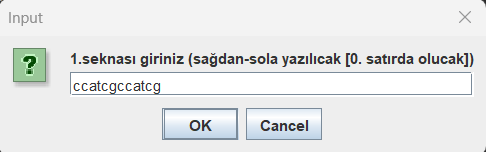
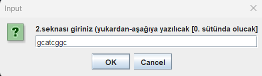
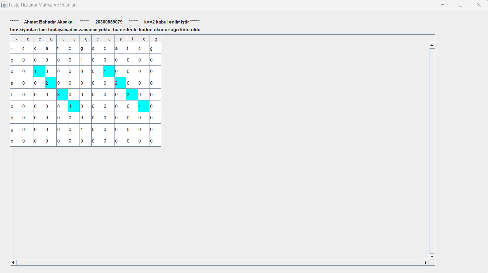

# Java Dili Yazmış Olduğum Hesaplamalı Biyoloji Dersi Proje Ödevim 

<h3 align="center" color="Darkblue">Ahmet Bahadır Aksakal</h3>
<h4 align="center" color="Darkblue">20360859079</h4>
<h5 align="center" color="Darkblue">Bursa Teknik Üniversitesi - 2. Sınıf 2.Dönem - Hesaplamalı Biyoloji Dersi Proje Ödevi</h5>

<ol>
  <li>
      <h3 color="Red">Program Ne Yapar</h3>
      <ul>
        <li>Bu program iki gen dizisini karşılaştırarak, bu gen dizilerini haritalamaktadır.</li>
      </ul>
  </li>
  <li>
      <h3 color="Red">Projede Kullanılan Teknoloji Ve Diller:</h3>
      <ul>
        <li>Java</li>
        <li>Java - Swing</li>
      </ul>
  </li>
  <li>
      <h3 color="Red">Nasıl Kullanılır</h3>
      <ul>
        <li>Program derlenmiş java dosyası üzerinden çalıştırılır.</li>
        <li>İlk gelen input pencresine iligi gen dizisi kopyalanır ve 'ok' butonuna tıklanır.</li>
        <li>İkinci gelen input pencresine iligi gen dizisi kopyalanır ve 'ok' butonuna tıklanır.</li>
        <li>Program otomatik olarak ilgili dizileri haritalandırıp görselleştirecektir.</li>
      </ul>
  </li>
  <li>
      <h3 color="Red">Detaylı Çalışma Yapısı Ve Fonksiyon Açıklamları</h3>
      <ul>
        <li>
         <h4 color="Darkblue">Adım 1:</h4>
            

               Kitabımızda bahsi geçen işlemi yapabilmek için kullanıcadan iki adet matris almam lazımdı. 
               Bu işlemi sekans al isimli metodun içinde gerçekleştirdim. Bu aşamada DNA dizilerinin A,C,G ve T bazlarından
               oluştuğunu bildiğimiz için başka karakterleri kabul etmeyecek bir kod yazdım.
               Aynı zamanda fonksiyonu büyük-küçük harfe duyarlı olmayacak şekilde tasarladım.
            

        </li>
        <li>
         <h4 color="Darkblue">Adım 2:</h4>
            

               Dot matrisi oluşturabilmek için sekansların k sayısı (bazlara kaçlı olarak bakılacığı)'nı kullanıcadan almam lazımdı fakat
               bu işlem zaten uzun olan kodu iyice uzatacağından ve oknurluğu düşereceğinden aynı zamanda karşılaştığım  örnek şablonlarda
               k sayısını hep iki olarak alınmış olduğundan bende k yı iki kabul ederek işlemlerime devam ettim. Fakat bu aşamadı k=2 gibi 
               bir belirleme yapmaktansa direkt olarak kodu k=2 imiş gibi yazdım. Bu nedenle k sayısı diye bir şey kaynak kodun içinde yok.
            

        </li>
       <li>
         <h4 color="Darkblue">Adım 3:</h4>
            

               Dot-matris kurallarına uygun olarak kesişim noktalarını bulan ve bu noktaları paunlayan bir kod yazdım.
               Bu kurallara uygun bir biçimde kesişen noktaların devam etmesi durumunda , bu hücrenin puanını +1 puan daha artırdım.
            

        </li>
       <li>
         <h4 color="Darkblue">Adım 4:</h4>
            

               Javada bulunan swing kütüphanesinin içindeki Jtable'ı kullanarak elde ettiğimiz dot matrisi
               renklendirilmiş olarak ekrana veren  bir pencere yaptım. 
            

        </li>
       <li>
         <h4 color="Darkblue">Adım 5:</h4>
            

              Kodu test ettim elimde hazır örnek ve tablolarla karşılaştırarak sorunsuzca çalıştığını ispatladım.
            

        </li>
      </ul>
  </li>
  <li>
      <h3 color="Red">Programdan Görseller:</h3>
      <ul>        
        <li></li> 
        <li></li>
        <li></li>
      </ul>
  </li>
</ol>

 
